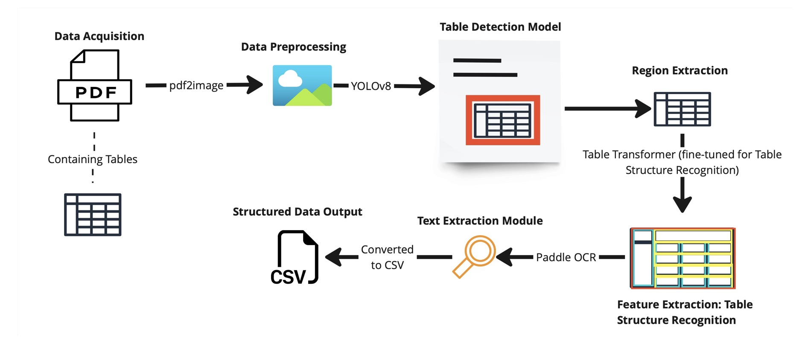

# MACHINE LEARNING FOR TABLE INFORMATION EXTRACTION  📝



## Table of Contents
1. [Overview](#overview)
2. [Installation](#installation)
3. [Usage](#usage)
4. [Features](#features)
5. [FAQ](#faq)
6. [Repository Structure](#repositorystructure)

## Overview
The **PDF Table Extraction Tool** is a CLI-based tool designed for extracting tabular data from PDF documents using machine learning models. It simplifies data extraction, supporting complex table structures and embedded OCR for text recognition.

## Installation
### Requirements
- Python 3.12
- Poppler 24.08.0
- Windows Visual C++ Redistributable for Visual Studio 2019

### Steps to Install
1. Clone the repository: `git clone https://github.com/username/repository.git`
2. Navigate to the project folder: `cd repository`
3. Run the installer or set up dependencies manually.

### Usage
**Running the tool:** 
Run the Table Extractor CLI batch file as Administrator, this will create a virtual environment and install the dependencies.  

Alternatively, you can launch the Command Prompt (CDM) and type in the Terminal: 

cd <path to Python script> 
Typing this command will run the tool: 
Python pipeline_extractor.py path/to/input --output path/to/output --poppler_path "C:\poppler-24.08.0\Library\bin 

## Prompts
Users will be prompted to select between the Options of 1-3 from the main menu: 

Option 1:  Select this option to begin the table extraction process.  If you wish to use the current directory for input and output press ENTER, this will use the current directory.   If you prefer a custom input and output location, please specify these paths when prompted. Please ensure you have the PDF file you want to extract in this directory. 

Option 2: Select this option if you would like to change the Poppler path.  If you select this option, you will be prompted to specify the new Poppler path. 

Option 3: Select this option if you wish to close the program. 

Once the tool processes the PDF file, the script will display a confirmation message:  
**Processing complete**

The extracted table information will now be saved in the specified Output folder. 
Within the Output folder, a new folder will be created, titled with the name of the PDF file extracted (This folder will contain the output results of the extraction)
Located within this folder is extracted table information saved as a CSV file. 

After processing the file, the Extraction Tool will prompt: 

**Would you like to process more files? (Y/N):**

**Select Y**: To return to the main menu and process more files 

**Select N:** To end the program. 

## Features
- 🚀 High accuracy table detection
- 🖥️ Command-line interface for easy automation
- 📄 Outputs in CSV Format with bounding box visuals!

## FAQ
The Frequently Asked Question (FAQ) section will answer common questions, help users resolve common issues and provide troubleshooting tips. 

 
**Q. What is the purpose of the tool?**
 
A: The Extraction Tool is designed to streamline and automate the table extraction process by extracting table information from PDF files. 
 
**Q. How does the tool detect tables?**
 
A: The table extraction tool utilises two machine learning models to detect tables and handle table structure recognition. 
 
**Q. How does the tool extract information from tables?**
 
A: The tool has integrated OCR capabilities to scan each cell of the table to extract text. 
 
 
**Q. Can the tool extract table information from image-based PDF documents?** 
 
A: Yes. 
 
 
**Q. How accurate is the information extracted?**
 
A: The Extraction Tool has an end-to-end accuracy score of 80%. 
 

**Q. Does the tool extract tables from non-PDF files?**

 
A: The tool is limited to only processing PDF documents. 
 
 
**Q. How many PDFs can be processed at once?**
 
A: The tool can extract one PDF file at a time and is capable of processing PDF file sizes greater than 10MB.  
 
 
**Q. Why am I getting error messages during installation?**
 
A: Please ensure you have the table extraction tool located in the same driver as Python during installation. 
 
**Q. Why am I getting errors with dependencies?**
 
A : Please ensure you have the correct Python path set up within your system; you can configure this in Advanced systems settings. 
 
**Q. Why is the tool not generating an output?** 
 
A: Please ensure you the required libraries and dependencies installed and that they are in the system’s PATH. 


## Repository Structure
Here's an overview of the repository structure and what you'll find in each part:
```plaintext
├── cli_folder
│   ├── requirements.txt
│   ├── logs
│   ├── pdf_table_extractor - training ver.py
│   ├── Camelot_and_Machine_Learning.ipynb
│   ├── pdf_table_extractor.py
│   └── temp_table.png
│
├── Capstone1
│   ├── Tables
│   ├── Copy_of_Model_Testing_and_Metrics.ipynb
│   ├── ML_for_Table_Extraction_Model_Testing.ipynb
│   ├── Table_Extraction_Metric_Testing.ipynb
│   ├── Ayrn output
│   ├── DocTR csv output
│   └── Model_Testing_and_Metrics.ipynb
│
├── README.md
├── .gitignore
│
└── Capstone2
    ├── Model Training Attempts
    ├── MISC
    ├── Testing
    └── Final
